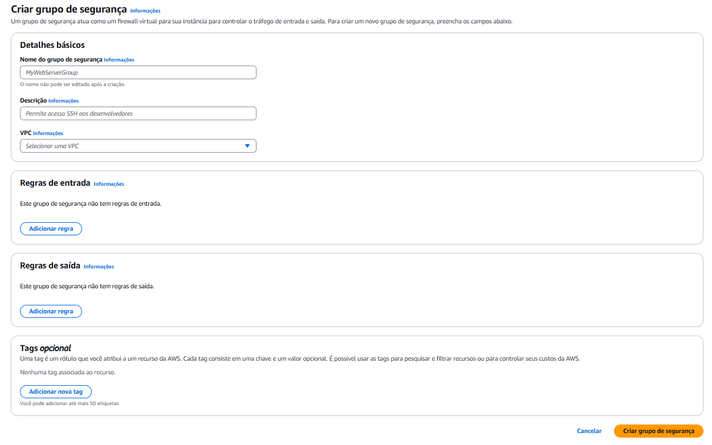
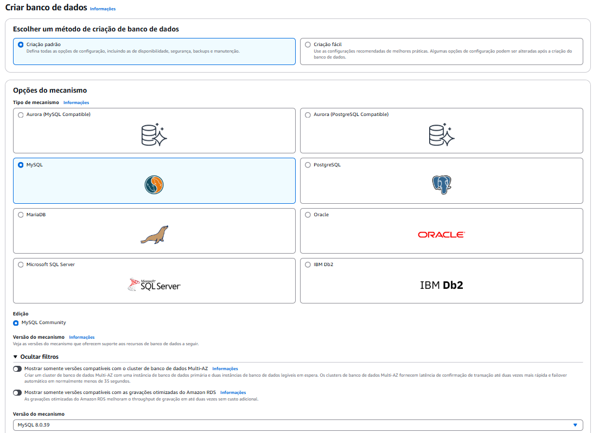
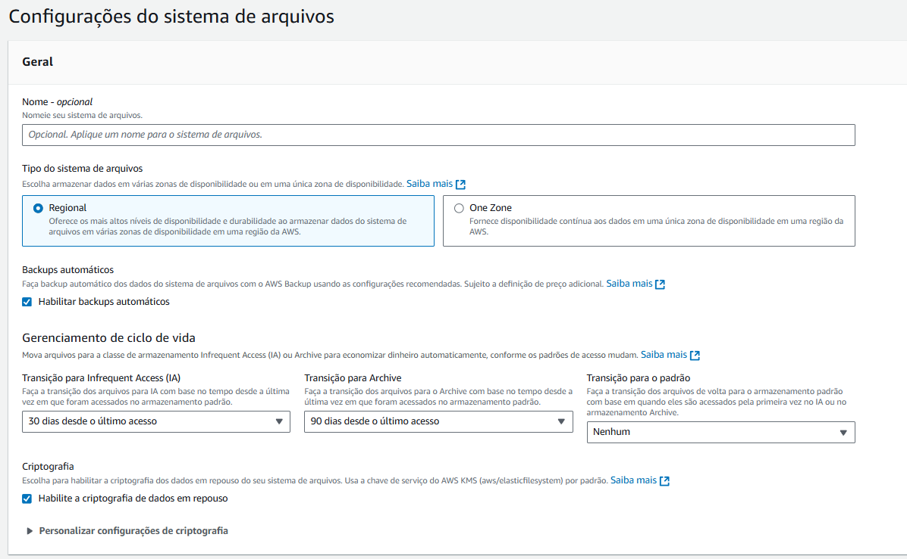
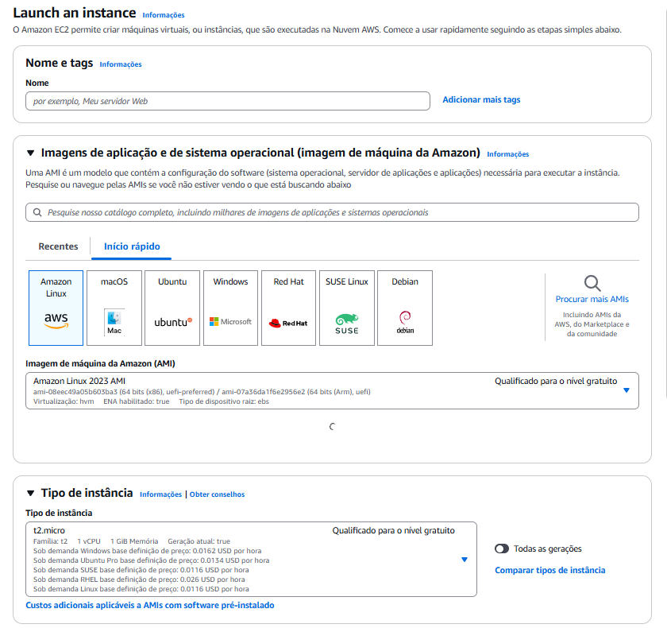
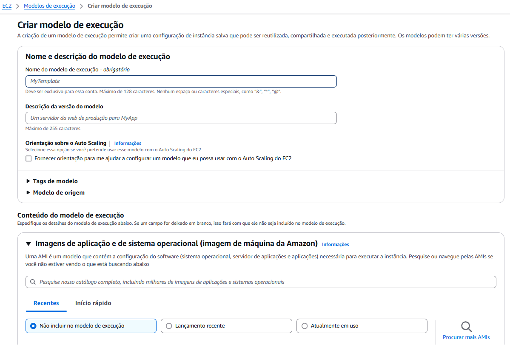
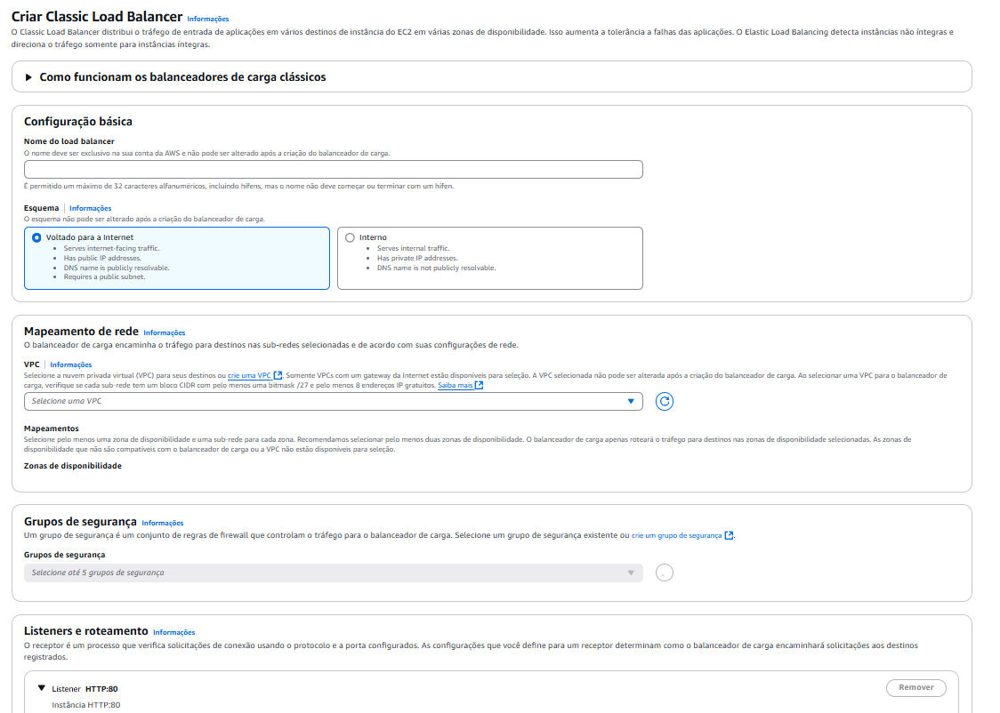

# Executar WordPress contênizado usando Ferramentas da AWS 

O projeto disposto na segunda fase consiste em elaborar um ambiente escalável e seguro para rodar uma aplicação WordPress. Este trabalho envolve configurar diversos serviços e tecnologias para garantir o funcionamento do site com o armazenamento persistente, balanceamento de carga e integração com um banco de dados gerenciado.


# Arquitetura Disposta


### 1- Criar a  VPC  


Para criação da VPC, afim de distribuir toda a infraestrutura da rede para conexão das instâncias, fiz da seguinte forma:


Usei o modo defaut de criação de VPC, para que assim pudesse aprimorar com o desencadear do projeto.

Foi criada 4 subnets, sendo duas Públicas e dua Privadas, para agregar as duas EC2, sendo uma ná pública e a outra em uma privada, limitando o acesso.Dentro desta privada é que rodará nosso script com WordPress. E ainda, estas 4 distribiuídas em duas zonas de disponibilidade, 1a e 1b.

Para controlar o acesso, criei um Gateway NAT, para controlar o acesso entre as redes na VPC.

### 2- SG (Security Groups) 

Após a criação da VPC, foi designado um Grupo de segurança para designar a forma de comunicação das Instâncias e assim limitar e liberar o acesso delas a recursos de infra.

Para o RDS, e o EFS (que veremos a frente), foram alocados em um grupo privado, onde apenas a instância pública tem acesso a eles. Sendo o BD acessado pela porta 3306 e o EFS na porta 2049.

Já para as instâncias, foi criado um grupo público, com IP aberto, para que possa acessar as instâncias privadas.




### 3- RDS ( Banco de Dados) 


Para que que a aplicação WordPress possa rodar, ela precisa estar conectada a um Banco de dados. E para criação dele, usei a documentação presente 👉[Neste link da AWS](https://aws.amazon.com/pt/tutorials/deploy-wordpress-with-amazon-rds/module-one/).

Para resumo, escolhi a opção criação padrão, em seguida selecionei a opção MySQL.

Neste momento, não usamos a opção Conectar-se a um recurso de computação do EC2, pois a instância ainda não foi criada.

O Template, use Free Tier

Nas configurações siga:
- DB instance: database-1
- Master Username: (nome de sua escolha)
- Master Password: (senha de sua escolha)

Conectividade
Use a VCP que criamos acima
escolha o SG privado, conforme criamos acima
Zona de disponibilidade, use (no preference)

E em Informações adicionais 
- Nome inical do Banco de Dados: (de sua escolha)



### 4- Criação do EFS 


Para que os dados da aplicação fiquem salvos, configuramos o EFS desta forma:

Aperte em `Criar Sistemas de Arquivos`
Escolha o nome de sua preferência
Em VPC, selecione a que criamos acima
Aperte em `Criar`



### 5- Criar da EC2 

Para montar a EC2, de início, recomenda-se a criação a mão da instancia para testes e assim poder montar o seu `user_data.yaml`. Vá para o menu EC2 e clique em Executar Instância

❗Recomendo de início, fazer a leitura deste 👉[Documento](https://aws.amazon.com/pt/getting-started/hands-on/deploy-wordpress-with-amazon-rds/3/)

Os parâmetros são:

 ***Nomes e Tags;***

|Chave      |   Valor           | Tipos de Recurso |
|-----------|-------------------|------------------|
|Name       | Forn. Pela Compass|Instância e Volumes|
|CostCenter      | Forn. Pela Compass|Instância e Volumes|
|Project       | Forn. Pela Compass|Instância e Volumes|


A imagem que usei foi a Ubuntu Server que estava neste momento na versão 24.04 LTS
O tipo de instância usada foi T2.micro

Criei uma Key pair (Pares de Chaves🔑) usando ED25519 versão `.pem` 

A rede, use a VPC que criamos anteriormente, selecione a Subnet pública e o SG que criamos anteriormente

Seu armazenamento use: 8GB gp2




Após a criação, use o seguinte comando via SSH no terminal para acessar a sua instância, usando o IPV4 público, ou o DNS público.

```
sudo chmod 400 chavePub.pem
ssh -i chavePub.pem ubuntu@cole-o-ip-aqui
```

❗Dica Importante!
Deve-se estar no diretório da chave para que o comando funcione. Ou seja, se o arquivo `chave.pem` estiver na sua pasta de Downloads, por exemplo, inicie o terminal dentro desta página.

Assim que acessar a máquina, use os comandos abaixo para instalar o Docker  e liberar acesso direto ao usuário, após isso, reinicie a instancia para que as permições sejam aplicadas, ou use `newgrp docker`

```
sudo apt-get install -y docker-ce docker-ce-cli containerd.io docker-compose-plugin
````

Para iniciar o Docker e dar permissões ao usuário:

```
sudo systemctl start docker
sudo systemctl enable Docker
sudo usermod -aG docker ubuntu
````


#### 5.1 Montando o EFS na instância

Com o Docker instalado e Rodando, monta-se o EFS na máquina, para isso use o comando abaixo para instalar o nfs-common (como usamos a imagem do Ubuntu).
Para a montagem, existem dois modos, via DNS e IP, eu escolhi a opçãop IP
Neste comando, também criamos o diretório efs, pelo código: `sudo mkdir /efs`


```
#Instala o nfs-common e monta o efs no sistema
sudo apt-get -y install nfs-common
sudo mkdir /efs
sudo mount -t nfs4 -o nfsvers=4.1,rsize=1048576,wsize=1048576,hard,timeo=600,retrans=2,noresvport 10.0.0.49:/ /efs
sudo chmod 666 /etc/fstab
sudo echo "10.0.0.49:/     /efs      nfs4      nfsvers=4.1,rsize=1048576,wsize=1048576,hard,timeo=600,retrans=2,noresvport,_netdev      0      0" >> /etc/fstab
```

#### 5.2- Docker Compose

Para agregar as informações necessárias e assim fazer o contêiner subir na instância, precisa-se criar um comando para  que o WordPress possa alocar os arquivos em um volume, que no caso é o nosso EFS, e os dados de acesso salvos dentro do BD que é o nosso RDS.
Neste arquivo indicamos as variáveis para comunicação entre eles.

Para criar, use o Vim ou o Nano. (aqui eu usei o Vim)

`sudo vi docker-compose.yaml`

👉[Arquivo Docker Compose](docker-compose.yaml)

Após a criação, use o comando para executar:

```
docker-compose -f docker-compose.yaml up -d
```


### 5.3- Arquivo `user_data.sh`

 🔹Crie um arquivo `user_data.sh`: Esse script será executado automaticamente durante a inicialização da instância EC2.

 🔹Adicione o código abaixo ao seu `user_data.sh`:


👉 [Acesse o arquivo aqui](user-data.sh)


### 6- Modelo e Execução (LaunchTemplate)

Para criação do Template (ou modelo de Execução) eu usei as mesmas configurações que usamos para criar uma instância [neste passo a passo aqui](#criar-da-ec2), com a ajuda deste [link](https://docs.aws.amazon.com/pt_br/AWSEC2/latest/UserGuide/create-launch-template.html).
Este template server para iniciar o processo de automatização na criação da instância, permitindo agilidade no processo.
A partir dele, podemos usar o nosso `user_data.sh`.



#### 7- Load Balancer 


O Load Balancer permite a escolha de forma automatizada, de uma instância para que seja acessada na internet. Checando a sua integridade e saúde para que através do seu endereço de DNS possa ser feito assim o acesso.

Para criar acesse EC2 ➡️ Load Balancers e selecione o modo **Classic Load Balancer**



#### 8- NAT Gateway 


Permite o acesso das instâncias privadas  a internet, já que até o momento, apenas a máquina pública dispoe de acesso:

🔹Para isso:

Vá em VPC -> Gateway NAT e clique em Criar Gateway NAT.
Nomeie como `example-nat-gateway`, selecione a sub-rede pública `example-public-subnet` (com conectividade Pública) e clique em Alocar IP Elástico.
Após criar o Gateway NAT, associe-o à tabela de rotas da sub-rede privada:

Acesse VPC -> Tabelas de Rotas.
Encontre a tabela `example-private-route-table` e, em Rotas -> Editar Rotas, adicione uma rota para 0.0.0.0/0 apontando para o Gateway NAT `example-nat-gateway`.


#### Conclusões e Agradecimentos

Quero agradecer pelo conhecimento adquirido ao longo desse projeto, que me permitiu configurar um ambiente seguro e escalável na AWS para rodar um site WordPress. Com as orientações, consegui estruturar uma VPC com sub-redes públicas e privadas, configurar o RDS como banco de dados e o EFS para armazenar os dados de forma persistente.

Também aprendi a implementar um Load Balancer, configurar um Gateway NAT e ajustar grupos de segurança para proteger o ambiente. Utilizei Docker e Docker Compose para integrar o WordPress ao EFS e ao RDS, e automatizei o processo com um script user_data.sh e um template de execução. Esse aprendizado foi essencial para garantir alta disponibilidade e segurança no projeto. Muito obrigado!


